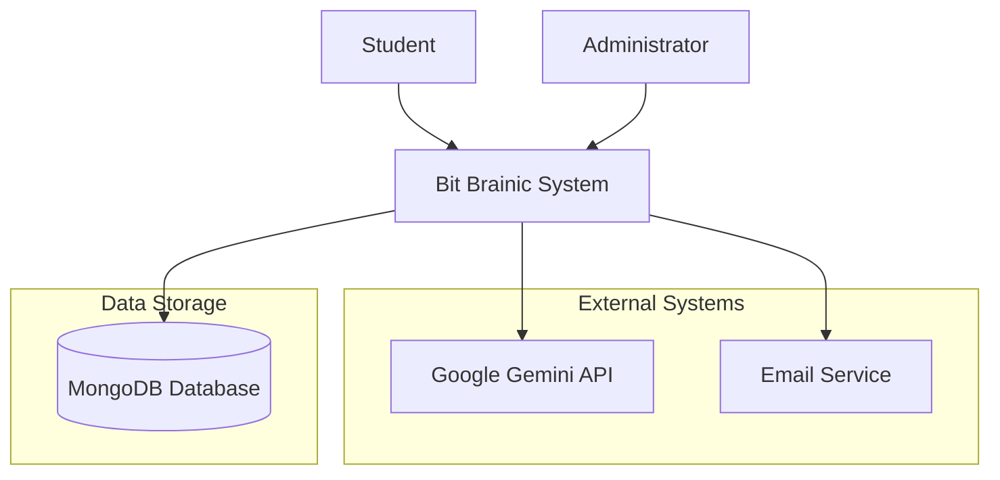
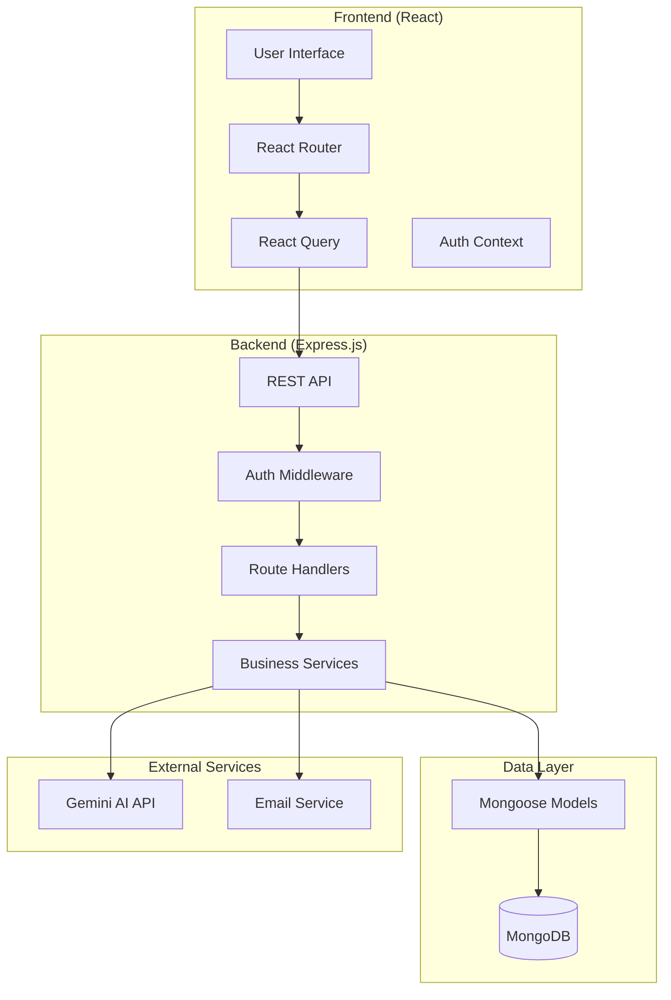
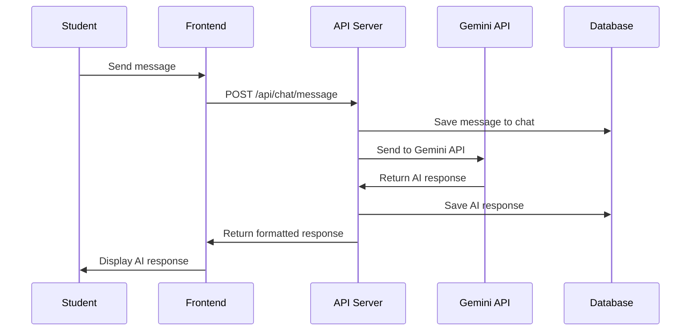

# Design Document

## Overview

This design outlines comprehensive documentation for the Bit Brainic AI tutoring platform, including detailed use cases, system architecture diagrams, user interaction flows, and technical specifications. The documentation will serve developers, product managers, architects, QA engineers, and end users.

## Architecture

### Documentation Structure
```
docs/
├── use-cases/           # Detailed use case specifications
├── architecture/        # System architecture diagrams
├── user-flows/         # User interaction diagrams
├── api/                # API documentation
├── deployment/         # Deployment and infrastructure docs
└── user-guide/         # End-user documentation
```

### Documentation Components

#### 1. Use Case Documentation
- **Actor Definitions**: Students, Tutors (AI), Administrators, Guests
- **Use Case Specifications**: Detailed scenarios with preconditions, flows, and postconditions
- **System Boundaries**: Clear definition of system scope and external interfaces

#### 2. Architecture Diagrams
- **System Context Diagram**: High-level system boundaries and external entities
- **Component Diagram**: Internal system components and their relationships
- **Deployment Diagram**: Infrastructure and deployment architecture
- **Data Flow Diagrams**: Information flow through the system

#### 3. User Flow Documentation
- **Authentication Flows**: Registration, login, password recovery
- **Chat Interaction Flows**: AI tutoring session lifecycle
- **Administrative Flows**: User management and system administration

## Components and Interfaces

### Use Case Specifications

#### Primary Actors
1. **Student**: End user seeking CS tutoring
2. **AI Tutor**: Gemini-powered tutoring system
3. **Administrator**: System manager
4. **Guest**: Unauthenticated visitor

#### Core Use Cases

##### UC-01: Student Registration and Authentication
- **Primary Actor**: Student
- **Preconditions**: User has internet access and valid email
- **Main Success Scenario**:
  1. Student navigates to registration page
  2. System displays registration form
  3. Student enters personal information and credentials
  4. System validates information and creates account
  5. System sends verification email
  6. Student verifies email and gains access

##### UC-02: AI Tutoring Session
- **Primary Actor**: Student
- **Secondary Actor**: AI Tutor (Gemini)
- **Preconditions**: Student is authenticated
- **Main Success Scenario**:
  1. Student initiates new chat session
  2. System creates chat context and connects to Gemini API
  3. Student asks CS-related question
  4. AI Tutor processes question and generates response
  5. System displays formatted response with code examples
  6. Student continues conversation or ends session

##### UC-03: Administrative User Management
- **Primary Actor**: Administrator
- **Preconditions**: Administrator is authenticated with admin privileges
- **Main Success Scenario**:
  1. Administrator accesses admin dashboard
  2. System displays user management interface
  3. Administrator views user list and statistics
  4. Administrator performs user management actions
  5. System updates user records and logs actions

### System Architecture Diagrams

#### System Context Diagram


#### Component Architecture


#### Data Flow Diagram - Chat Session


## Data Models

### User Model
```javascript
{
  _id: ObjectId,
  email: String (unique),
  password: String (hashed),
  name: String,
  role: String (enum: ['student', 'admin']),
  isVerified: Boolean,
  createdAt: Date,
  lastLogin: Date
}
```

### Chat Model
```javascript
{
  _id: ObjectId,
  userId: ObjectId (ref: User),
  title: String,
  messages: [ObjectId] (ref: Message),
  createdAt: Date,
  updatedAt: Date,
  isActive: Boolean
}
```

### Message Model
```javascript
{
  _id: ObjectId,
  chatId: ObjectId (ref: Chat),
  content: String,
  sender: String (enum: ['user', 'ai']),
  timestamp: Date,
  metadata: {
    tokens: Number,
    processingTime: Number
  }
}
```

## Error Handling

### Error Categories
1. **Authentication Errors**: Invalid credentials, expired tokens
2. **Validation Errors**: Invalid input data, missing required fields
3. **API Errors**: Gemini API failures, rate limiting
4. **Database Errors**: Connection issues, data integrity violations
5. **System Errors**: Server errors, network issues

### Error Response Format
```javascript
{
  success: false,
  error: {
    code: "ERROR_CODE",
    message: "Human readable message",
    details: "Additional technical details",
    timestamp: "2024-01-16T10:00:00Z"
  }
}
```

## Testing Strategy

### Unit Testing
- **Frontend**: React component testing with Jest and React Testing Library
- **Backend**: API endpoint testing with Jest and Supertest
- **Services**: Business logic testing with mocked dependencies

### Integration Testing
- **API Integration**: Full request/response cycle testing
- **Database Integration**: Data persistence and retrieval testing
- **External Service Integration**: Gemini API integration testing

### End-to-End Testing
- **User Flows**: Complete user journey testing
- **Cross-browser Testing**: Compatibility across different browsers
- **Performance Testing**: Load testing and response time validation

### Test Data Management
- **Test Database**: Separate MongoDB instance for testing
- **Mock Data**: Predefined test datasets for consistent testing
- **API Mocking**: Mock external services for isolated testing