# Bit Brainic - Use Case Diagram

## Complete UML Use Case Diagram (Mermaid)

```mermaid
%%{init: {'theme': 'base', 'themeVariables': { 'primaryColor': '#E3F2FD', 'primaryTextColor': '#1565C0', 'primaryBorderColor': '#1976D2', 'lineColor': '#37474F', 'secondaryColor': '#FFF3E0', 'tertiaryColor': '#FCE4EC'}}}%%

flowchart TB
    subgraph Actors["👥 ACTORS"]
        Guest["🌐 Guest<br/>(Visitor)"]
        User["👤 Registered<br/>User"]
        Admin["🔧 Admin"]
        AI["🤖 Gemini AI<br/>System"]
        Email["📧 Email<br/>System"]
    end

    subgraph System["🏢 BIT BRAINIC SYSTEM"]
        
        subgraph Public["🌍 PUBLIC WEBSITE"]
            UC1["View Home Page"]
            UC2["View Features Page"]
            UC3["View About Page"]
            UC4["View Contact Page"]
            UC5["Submit Contact Form"]
            UC6["Get Public Stats"]
        end

        subgraph Auth["🔐 AUTHENTICATION"]
            UC7["Register Account"]
            UC8["Sign In"]
            UC9["Logout"]
            UC10["Verify JWT Token"]
        end

        subgraph Profile["👤 PROFILE MANAGEMENT"]
            UC11["View Profile"]
            UC12["Update Profile<br/>(Name/Email)"]
            UC13["Update Password"]
            UC14["Select/Update<br/>Interests"]
            UC15["Set/Update<br/>Persona Prompt"]
            UC16["Delete Account"]
        end

        subgraph Chat["💬 CHAT MANAGEMENT"]
            UC17["View All Chats"]
            UC18["Create New Chat"]
            UC19["Open/View Chat"]
            UC20["Send Message"]
            UC21["Receive AI Response"]
            UC22["Rename Chat"]
            UC23["Delete Chat"]
        end

        subgraph AIProc["🧠 AI PROCESSING"]
            UC24["Generate AI Response"]
            UC25["Build Personalized<br/>System Prompt"]
            UC26["Manage Chat History<br/>(Trim to 30 msgs)"]
            UC27["Handle API Errors<br/>& Retry"]
            UC28["Auto-Generate<br/>Chat Title"]
        end

        subgraph AdminPanel["⚙️ ADMIN PANEL"]
            UC29["Admin Login<br/>(Password Verify)"]
            UC30["View Dashboard<br/>Statistics"]
            UC31["View Activity<br/>Charts (7-day)"]
            UC32["View Top<br/>Active Users"]
            UC33["Search & List<br/>All Users"]
            UC34["View User Details"]
            UC35["Edit User"]
            UC36["Delete User"]
        end

        subgraph EmailSvc["📨 EMAIL SERVICES"]
            UC37["Send Contact<br/>Email to Admin"]
            UC38["Send Auto-Reply<br/>to User"]
        end
    end

    %% Guest Relationships
    Guest --> UC1
    Guest --> UC2
    Guest --> UC3
    Guest --> UC4
    Guest --> UC5
    Guest --> UC7
    Guest --> UC8

    %% User Relationships
    User --> UC8
    User --> UC9
    User --> UC11
    User --> UC12
    User --> UC13
    User --> UC14
    User --> UC15
    User --> UC16
    User --> UC17
    User --> UC18
    User --> UC19
    User --> UC20
    User --> UC22
    User --> UC23

    %% Admin Relationships
    Admin --> UC29
    Admin --> UC30
    Admin --> UC31
    Admin --> UC32
    Admin --> UC33
    Admin --> UC34
    Admin --> UC35
    Admin --> UC36

    %% AI System Relationships
    AI --> UC24
    AI --> UC25
    AI --> UC26
    AI --> UC27

    %% Email System Relationships
    Email --> UC37
    Email --> UC38

    %% Include Relationships
    UC3 -.->|include| UC6
    UC5 -.->|include| UC37
    UC5 -.->|include| UC38
    UC20 -.->|include| UC24
    UC24 -.->|include| UC25
    UC24 -.->|include| UC26
    UC21 -.->|include| UC24
    UC8 -.->|include| UC10

    %% Extend Relationships
    UC27 -.->|extend| UC24
    UC28 -.->|extend| UC20
    UC14 -.->|extend| UC7

    %% Actor Inheritance
    Guest -.->|inherits| User
    User -.->|inherits| Admin

    %% Styling
    style Guest fill:#C8E6C9,stroke:#388E3C
    style User fill:#BBDEFB,stroke:#1976D2
    style Admin fill:#F8BBD9,stroke:#C2185B
    style AI fill:#E1BEE7,stroke:#7B1FA2
    style Email fill:#FFF9C4,stroke:#FBC02D
    
    style Public fill:#E8F5E9,stroke:#4CAF50
    style Auth fill:#E3F2FD,stroke:#2196F3
    style Profile fill:#E3F2FD,stroke:#2196F3
    style Chat fill:#FFF3E0,stroke:#FF9800
    style AIProc fill:#F3E5F5,stroke:#9C27B0
    style AdminPanel fill:#FCE4EC,stroke:#E91E63
    style EmailSvc fill:#FFFDE7,stroke:#FBC02D
```



---

## 📋 Use Case Summary Table

### Guest (Visitor) Use Cases
| UC ID | Use Case | Description |
|-------|----------|-------------|
| UC1 | View Home Page | Browse landing page |
| UC2 | View Features Page | See platform features |
| UC3 | View About Page | Read about platform (includes UC6) |
| UC4 | View Contact Page | Access contact info |
| UC5 | Submit Contact Form | Send message (includes UC37, UC38) |
| UC6 | Get Public Stats | Retrieve public statistics |
| UC7 | Register Account | Create new account (extends UC14) |
| UC8 | Sign In | Login with credentials (includes UC10) |

### Registered User Use Cases
| UC ID | Use Case | Description |
|-------|----------|-------------|
| UC9 | Logout | End session |
| UC10 | Verify JWT Token | Validate authentication token |
| UC11 | View Profile | See account information |
| UC12 | Update Profile | Change name/email |
| UC13 | Update Password | Change password |
| UC14 | Select/Update Interests | Choose CS topics (max 20) |
| UC15 | Set/Update Persona | Customize AI behavior (max 500 chars) |
| UC16 | Delete Account | Permanently delete account |
| UC17 | View All Chats | List all conversations |
| UC18 | Create New Chat | Start new conversation |
| UC19 | Open/View Chat | View chat with messages |
| UC20 | Send Message | Send message to AI (includes UC24) |
| UC21 | Receive AI Response | Get AI reply (includes UC24) |
| UC22 | Rename Chat | Update chat title |
| UC23 | Delete Chat | Remove chat and messages |

### AI System Use Cases
| UC ID | Use Case | Description |
|-------|----------|-------------|
| UC24 | Generate AI Response | Process via Gemini API |
| UC25 | Build Personalized Prompt | Include user interests/persona |
| UC26 | Manage Chat History | Trim to 30 messages |
| UC27 | Handle API Errors | Retry with backoff (extends UC24) |
| UC28 | Auto-Generate Title | Set title from first message (extends UC20) |

### Admin Use Cases
| UC ID | Use Case | Description |
|-------|----------|-------------|
| UC29 | Admin Login | Verify admin password |
| UC30 | View Dashboard Statistics | See overview stats |
| UC31 | View Activity Charts | See 7-day trends |
| UC32 | View Top Active Users | See most active users |
| UC33 | Search & List Users | Paginated user list with search |
| UC34 | View User Details | See specific user info |
| UC35 | Edit User | Update user data |
| UC36 | Delete User | Remove user and data |

### Email Service Use Cases
| UC ID | Use Case | Description |
|-------|----------|-------------|
| UC37 | Send Contact Email | Send form to admin |
| UC38 | Send Auto-Reply | Confirm receipt to user |

---

## 🔗 Relationships Legend

| Symbol | Relationship | Description |
|--------|--------------|-------------|
| `─────>` | Association | Actor uses/initiates use case |
| `- - ->` include | Include | Required sub-functionality |
| `- - ->` extend | Extend | Optional/conditional functionality |
| `- - ->` inherits | Generalization | Actor inheritance |

---

## 📊 Actor Hierarchy

```
Guest (Visitor)
    │
    └──> Registered User
              │
              └──> Admin
```

**Inheritance means:**
- **User** can do everything **Guest** can do, plus authenticated features
- **Admin** can do everything **User** can do, plus admin features

---

## 🎯 Key System Boundaries

1. **Public Website** - No authentication required
2. **Authentication** - Login/Register flows
3. **Profile Management** - User settings (Protected)
4. **Chat Management** - AI tutoring features (Protected)
5. **AI Processing** - Backend Gemini integration
6. **Admin Panel** - Administrative functions (Admin Password Protected)
7. **Email Services** - Contact form processing

